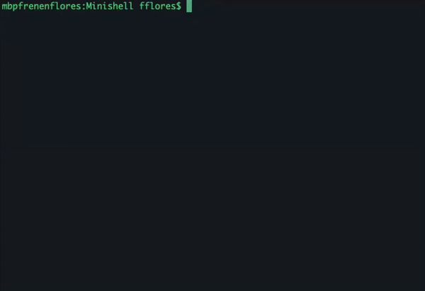

# Minishell
> This is a group project that i and my teammate [wabomina](https://github.com/wabomina?tab=overview&from=2019-12-01&to=2019-12-31) had completed.
The project is about coding our own shell that will work like the bash shell.

We have used the following projects:
- [Libft](https://github.com/FrenkenFlores/Libft): used functions that mimic libc functions;
- [Ft_printf](https://github.com/FrenkenFlores/Ft_printf): used to mange output;
- [Get_next_line](https://github.com/FrenkenFlores/Get_next_line): used to mange input.

## commands
bash builtins that are been implemented:
- echo with option ’-n’
- cd with only a relative or absolute path
- pwd without any options
- export without any options
- unset without any options
- env without any options and any arguments
- exit without any options

It supports redirections `< > >>`, pipes `|`, environment variables `$`, separation `;` and strings as well `""`,`''`.

It reacts on signals `ctrl-C`, `ctrl-D` and `ctrl-\` as bash shell does.

## Build instructions
```bash
git clone https://github.com/FrenkenFlores/Minishell.git
cd Minishell
make
./minishell
```
